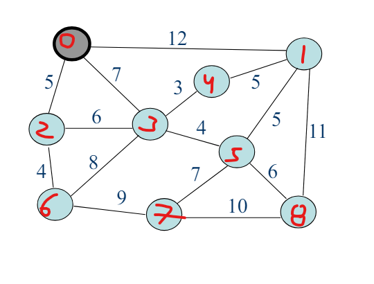
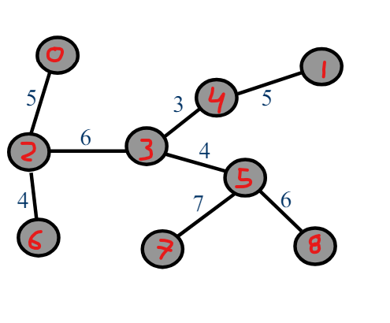
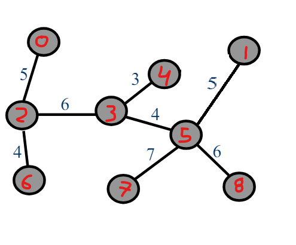

# Algoritmo de Prim 
Implementación del algoritmo de prim (Algoritmos voraces) para hallar un árbol generador minimal de un grafo

Grafo usado para probar el algoritmo:

Solución 1:

Solución 2:

